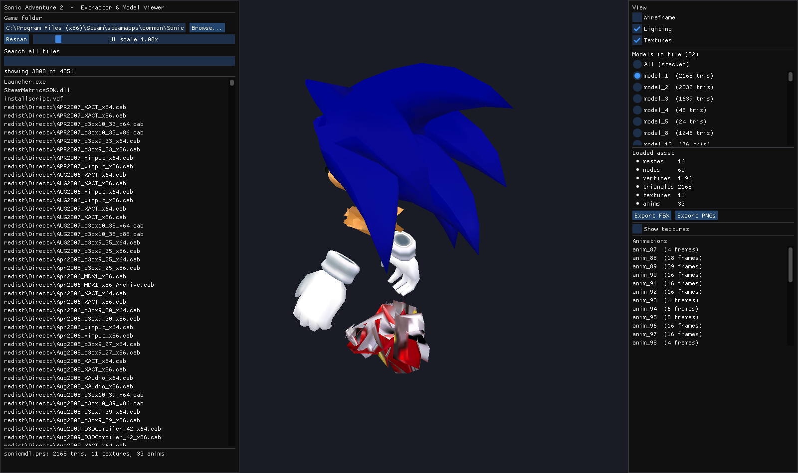
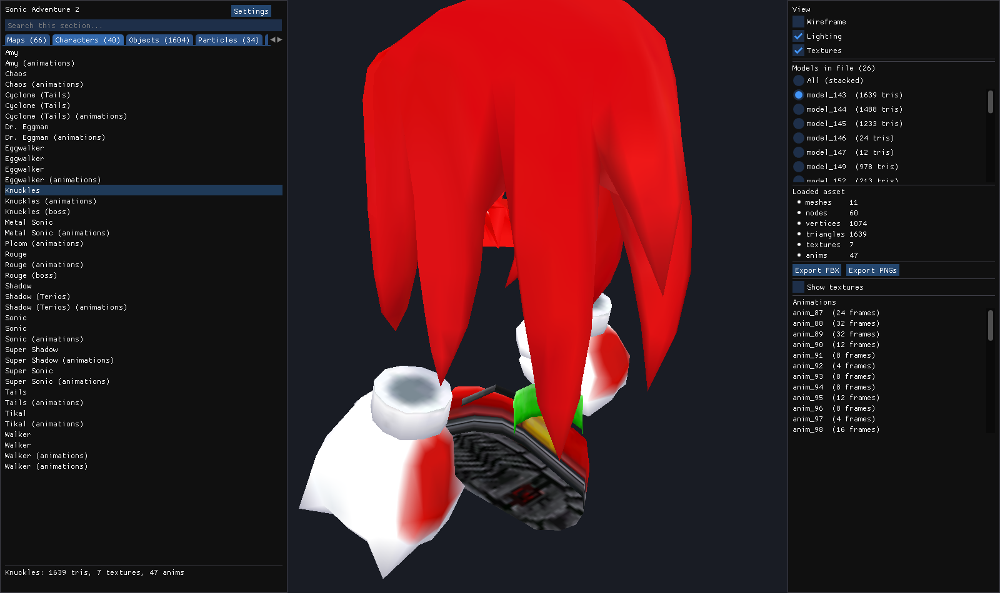
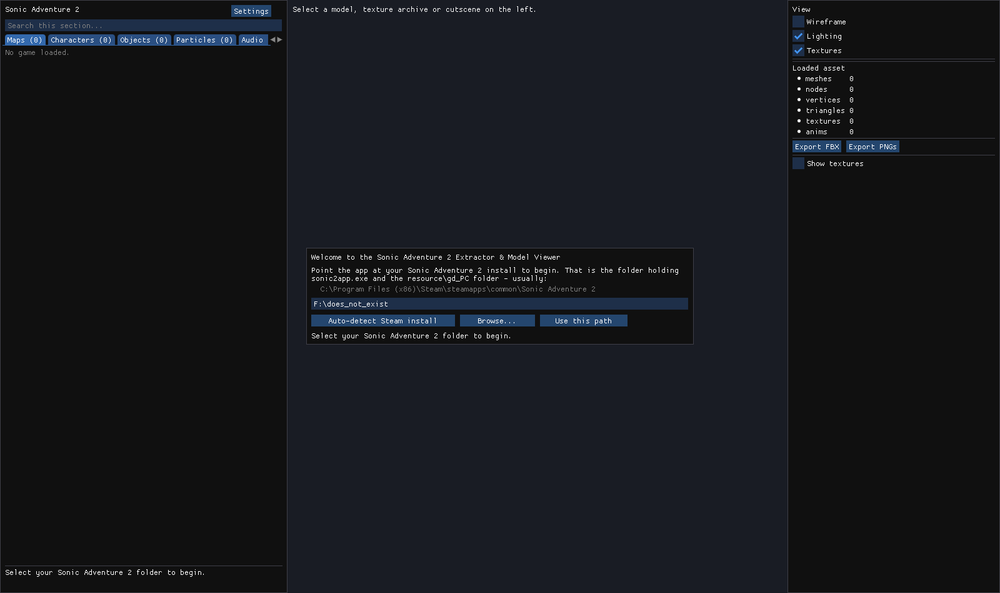
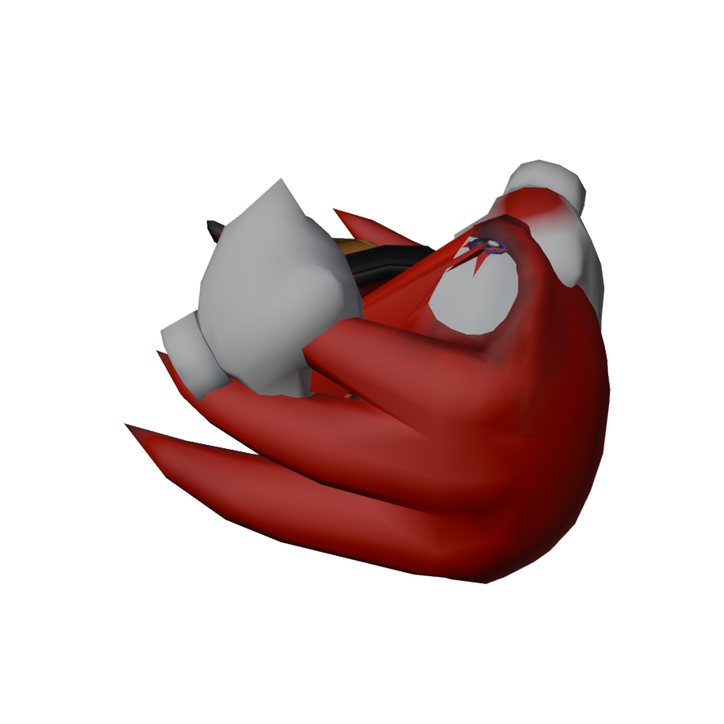

# Sonic Adventure 2 — Extractor & Model Viewer

A native Windows tool for browsing, extracting, viewing and exporting the assets
of **Sonic Adventure 2 (PC / Steam, 2012)**.



It reads the game's own formats directly — no intermediate tools, no runtime
dependencies. Everything was reverse-engineered from the retail build and is
verified by a batch regression that runs every parser over every shipped file.

---

## What it does

* **Browses** the whole game folder — 4,351 files indexed and classified.
* **Global search** across every filename.
* **Decompresses PRS** and reads **PAK** archives.
* **Decodes GVR/GVM textures** (GameCube CMPR, RGB5A3, indexed) plus DDS and PNG.
* **Extracts whole stages** — GameCube REL relocation, GC "Ginja" geometry and
  LandTables, including the animated-scenery `_uv`/`_ani`/`_x` sub-tables and the
  matching object placement (SET files).
* **Renders Chao World, textured** — every Chao area (Lobby, Hero/Dark/Neutral
  gardens, Entrance, Kindergarten, Karate, Stadium, the race courses) shows up as
  a **Chao World: …** entry under Maps, renders with its real textures, and
  exports to FBX. Chao files turned out to be **GameCube REL modules**, so they
  are relocated before reading — that is what fills in their vertex pointers; see
  [FORMATS §11](docs/FORMATS.md). Textures come from the matching `al_*_tex.prs`
  archives, bound through each module's own texture list. The Lobby is assembled
  from its three modules (room, `.rel`, and the garden-gate variant).
* **Friendly, organised browser** — assets are grouped into **Maps / Characters
  / Objects / Particles** tabs with names read straight from the game
  (`City Escape`, `Cannon's Core (Sonic)`, `Metal Sonic`, `Boss: Biolizard`),
  not raw file names. Auto-detects your Steam install; a first-run screen and a
  Settings panel let you set the game folder by hand if needed.
* **Renders models and stages** in a textured, lit 3D viewport (orbit + zoom),
  with a per-model / per-landtable selector, a **double-sided** toggle (SA2's
  single-sided stage walls otherwise vanish when you orbit behind them) and
  **animation playback** for characters (play/pause, frame scrubber).
* **Overlays a map's placed objects** — loading a stage also loads its `setNNNN`
  layout and drops a marker at every object/NPC, with an object list you can
  **zoom to**. (SA2 keeps the object *models* in `sonic2app.exe`, so the markers
  show placement, not the props themselves.)
* **Sky background** — an optional sky-gradient backdrop so maps sit against a
  sky instead of a black void (a stand-in; SA2's real per-stage skyboxes are
  compiled into the stage code, not shipped as loadable geometry).
* **Exports to binary FBX** with meshes, UVs, materials, textures, the node
  skeleton, skin clusters and every animation as its own take.
* **Exports a Unity/VRChat material set** — a `SA2Stage.shader` plus a
  `.materials.json` capturing each material's unlit / env-map / blend / diffuse
  state, and object placement as a scene JSON.
* **Exports textures** as PNG.
* **Plays and exports the music** — decodes SA2's CRI **ADX** audio
  (`resource/gd_PC/ADX/*.adx`), with an in-app **Play** button and **Export WAV**
  (`sa2cli wav in.adx out.wav`).
* **Enemy / object models from the executable** — SA2 compiles its enemy, NPC and
  object models into `sonic2app.exe` (little-endian Ninja trees) rather than the
  data folder. The viewer surfaces ~400 of them in an **Enemies** tab, each
  loadable and FBX-exportable (`sa2cli exemodels`, `sa2cli exefbx`).
* Persisted game-folder setting and a **UI scale slider** for high-DPI displays.

## Verified coverage

`sa2cli regress` over the retail Steam build:

```
  files indexed      : 4734
  PRS decompressed   : 2451 ok, 0 failed
  PAK archives       : 231 ok, 0 failed
  GVM archives       : 606 ok, 0 failed (16057 textures)
  character models   : 23 ok, 0 failed
  character motions  : 17 ok, 0 failed (817 motions, 345380 keys)
  event scenes       : 67 ok, 0 failed
  stage geometry     : 64 ok, 0 failed, 2 without landtable (999559 tris)
  geometry           : 1193400 vertices, 1303917 triangles
  suspect bounds     : 0
  RESULT             : ALL PASS
```

Every stage FBX is round-tripped through headless Blender: City Escape
(124,787 tris, 126 textures, 2,376 bones) and Crazy Gadget (three landtables:
main + `_uv` scroll + `_x` animated) both import clean.

The browser groups everything by friendly name — here the **Characters** tab
with Knuckles loaded, and the first-run setup screen:




## Getting it

Grab the latest `sa2-extractor-*-win64.zip` from
[Releases](../../releases) — a single statically linked `.exe`, no vcredist
required. Run `sa2viewer.exe`, click **Browse...** and point it at your
Sonic Adventure 2 folder (e.g.
`C:\Program Files (x86)\Steam\steamapps\common\Sonic Adventure 2`).

## Command line

```
sa2cli list      <game>              list and classify every asset
sa2cli search    <game> <query>      search asset names
sa2cli info      <file>              identify one file
sa2cli extract   <file> <outdir>     extract textures / PAK contents
sa2cli model     <file>              summarise the models in a file
sa2cli fbx       <file> <out.fbx> [n] export model n (-1 = all merged)
sa2cli stage     <stgXXD.rel> <dir>  export a stage: FBX + textures +
                                     Unity shader + material JSON + placement
sa2cli set       <setXXXX_s.bin>     list placed objects
sa2cli wav       <file.adx> <out.wav> decode CRI ADX music to a WAV
sa2cli exemodels <sonic2app.exe>     list models compiled into the exe
sa2cli exefbx    <exe> <out.fbx> <n> export embedded model n to FBX
sa2cli maps      <game>              load every map, report meshes/tris/textures
sa2cli regress   <game>              batch-test every parser on every file
```

`sa2cli stage stg13D.rel out/` produces, in `out/`: `stg13D.fbx` (all
landtables), the textures, `SA2Stage.shader`, `stg13D.materials.json`,
`apply_materials.py`, and `set0013_*.objects.json` (object placement).

## Building

Needs MSVC (2019 or newer) and CMake. All dependencies are vendored in
`extern/` — Dear ImGui, GLFW (prebuilt static, `/MT`) and stb.

```
powershell -ExecutionPolicy Bypass -File build.ps1
```

Output lands in `build\bin\`. The exe links the static CRT, so it runs on a
clean machine.

## Where the assets live

| Asset | Location |
|---|---|
| Playable character models | `resource/gd_PC/*mdl.prs` (23 files) |
| Character animations | `resource/gd_PC/*mtn.prs` (17 files, 817 motions) |
| Stages | `resource/gd_PC/stgXXD.rel` (64 with geometry) |
| Object placement | `resource/gd_PC/setXXXX_[su].bin` |
| Cutscene scenes | `resource/gd_PC/event/eNNNN.prs` (67 files) |
| Textures | `resource/gd_PC/**.prs` → GVM, and `*.pak` → DDS/PNG |

## FBX exports are checked in Blender, not just written

`tools/validate_fbx.py` imports an export with headless Blender (`pip install bpy`)
and asserts meshes, UVs, materials, image sizes, armature bones, skin weights that
resolve to real bones, and actions with actual keyframes.
`tools/render_fbx.py` renders one independently — this is Knuckles' head straight
out of `knuckmdl.prs`, imported and rendered by Blender with no manual fixing:



Across a random sample of exports: **6/6 pass**, e.g. `milesmdl` → 18/18 meshes with
UVs and vertex groups, 60 bones, 0 dangling groups, 30 actions, 83,910 keyframes.

## Stages, animations, NPCs and particles — what's honest

The stage viewer covers the parts of a stage that are genuinely stored as data.
A few things about SA2 are worth stating plainly, because they are compiled into
the game rather than sitting in a file:

* **Every map loads.** `sa2cli maps <game>` walks the whole Maps list and reports
  what each one yields — currently **83 of 83 with geometry, none empty**. That
  includes the two arenas that ship as bare GC model trees with no landtable (the
  Final Hazard and stage 42), which fall back to a direct model scan.
* **Stage geometry: fully supported.** 64 stage RELs extract, textured. Both the
  GC "Ginja" and the Dreamcast Chunk landtable variants are handled.
* **Stage animation is only partly data-driven.** The animated scenery *geometry*
  ships as auxiliary landtables (`_uv` scroll, `_ani`, `_x`) and is extracted as
  separate models. The *motion* that drives it (UV scroll rates, moving platforms)
  is bound by compiled game code and is not stored as replayable keyframes, so it
  is not reconstructed.
* **Object / NPC placement: supported. Model *mapping* is partial.** Every
  `setXXXX` file is parsed, exported as a scene JSON (id, position, rotation,
  scale) and overlaid on the loaded map with a zoom-to list. The enemy/NPC/object
  models themselves are compiled into `sonic2app.exe` — those are now extracted
  and browsable in the **Enemies** tab — but turning a placed object's *id* into
  the right one of those models needs the community `objdefs` ID→model table (an
  SA Tools artefact this project does not bundle), so the on-map markers are
  positions, not yet the resolved props.
* **Highest texture resolution is already reached.** The PC port did **not**
  upscale textures — its DDS replacements are the same resolution as the GVR
  originals. The tool prefers the PC DDS PAK when one exists (better alpha) and
  otherwise decodes the native GVR, which is the maximum available.
* **Particles are hardcoded.** SA2's in-game particle systems live in
  `sonic2app.exe`; only the effect *textures* are extractable (via the normal
  texture path) and only appearance parameters (`sp_info`) are data. Cutscene
  particle definitions in the event files are the one data-driven exception.

Other limits:

* **Cutscene animations are not exported** — the motions live in a separate
  `eNNNNmotion.bin` stream that is not parsed, so cutscene FBX files have 0 takes.
* **Character animations are matched by exact filename** — `sonicmdl.prs` picks up
  `sonicmtn.prs`, but variants like `bknuckmdl.prs` have no same-named `*mtn.prs`
  and export with no actions.
* Audio, video and message tables are indexed and classified but not decoded.

Character models use SA2's **cached weighted skinning** (the arms, legs and torso
blend between bones). Each vertex is baked to its bind-pose world position; the
FBX binds it to its dominant bone, so the mesh is solid and correctly shaped.
A skinned mesh's polygons are also **deferred**: SA2 stores them on one bone with
a *CacheList* chunk and draws them from a later bone with a *DrawList* chunk, once
every bone that deforms the mesh has written its weighted vertices to the shared
cache. The viewer honours this, so the torso (Sonic's body is drawn well after its
spine bones are posed) resolves in the right place instead of collapsing.

When a character loads the viewer **auto-plays its idle** — SA2 stores characters
in a raw, collapsed bind pose, so playing a motion is what makes the body read
correctly. Press **Bind pose** to see the unposed data, or pick any other motion.

A character's `*mdl.prs` holds many models — the first file entry is often a
partial sub-model, so the viewer surfaces the fullest model that matches an
animation's skeleton (by animated-node count) and shows that by default. The
matching `*mtn.prs` motions are applied to pose it; SA2 stores characters in a
raw bind pose, so the idle/animation is what makes them look right.

## Format notes

The reverse-engineering write-up — PRS, PAK, GVM/GVR, the Ninja chunk format
and its unusual per-field-size endianness, and the animation layout — is in
[docs/FORMATS.md](docs/FORMATS.md).

## Legal

This tool ships **no game data**. You need your own copy of Sonic Adventure 2.
Sonic Adventure 2 is © SEGA. This project is unaffiliated with SEGA and is
released under the [MIT License](LICENSE) for interoperability, preservation
and modding purposes.
